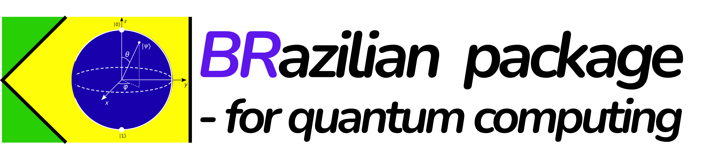

<p align="center">
  
</p>

<p align="center">
  <a href="https://www.python.org/"></a>
  <a href="LICENSE"></a>
  
</p>

---

## 🚀 Sobre o Projeto
Temos dis pacotes  **qbasic**   para simular numerica de sistema quantico e o **BRa**  que é voltado par ao ensino.

### Q-BASIC: Simulador Quântico Brasileiro 🇧🇷⚛️
(Quantum Brazilian Algorithms, SImulations, and Computational tools) é um simulador quântico open-source, feito no Brasil, para ensino, pesquisa e desenvolvimento de algoritmos quânticos. Foco em acessibilidade, didática e flexibilidade para simular sistemas quânticos, computação quântica e redes neurais quânticas. Uma versão customizada do QuTiP desenvolvida com **NumPy** e **PyTorch**, contendo métodos adicionais criados pelo nosso grupo de pesquisa na UFSCar.  


### BRa !psi>
Uma biblioteca dedicada ao ensino de computação quântica.  
- Foco total na introdução aos **conceitos básicos** e **algoritmos quânticos**.  
- Nome inspirado na notação Bra-Ket e no Brasil:  
- **Bra**: Referência ao Brasil e à notação "bra" da mecânica quântica. 

---
## ✨ Principais Recursos

- Simulação de sistemas quânticos (computação e óptica)
- Algoritmos quânticos básicos e avançados
- Backend customizável: NumPy, PyTorch, CuPy, Numba (em desenvolvimento)
- Suporte a matrizes densas e esparsas
- Ferramentas didáticas para ensino
- Código 100% Python, fácil de modificar

---

## 🖥️ Demonstração Rápida

```python
from qbasic.estados import estado_zero, estado_um
from qbasic.operador import X

# Estado inicial |0>
psi = estado_zero()

# Aplica porta X (NOT quântico)
psi_final = X @ psi
print(psi_final)
```

---

## 📂 Estrutura do Projeto

```text
Q-BASIC/
├── qbasic/                # Núcleo do simulador (NumPy, PyTorch, etc)
│   ├── estados.py         # Estados quânticos
│   ├── operador.py        # Operadores e portas
│   ├── class_tijolo.py    # Blocos básicos
│   └── ...
├── Tutorial_simulador/    # Notebooks didáticos
├── Testes/                # Testes e exemplos
└── README.md
```
---

## 📦 Instalação

```bash
# Clone o repositório
$ git clone https://github.com/seu-usuario/Q-BASIC.git
$ cd Q-BASIC

# (Recomenda-se usar um ambiente virtual)
$ pip install -r requirements.txt  # (ou instale numpy, etc)
```

---

## 🧑‍💻 Como Usar

- Explore os notebooks em `Tutorial_simulador/` para aprender e testar exemplos.
- Importe os módulos do pacote `qbasic` para criar seus próprios experimentos.

---

## 🛣️ Roadmap

- [x] Simulação básica de qubits
- [x] Matrizes esparsas (corrigido)
- [ ] Backend PyTorch
- [ ] Backend CuPy (GPU)
- [ ] Backend Numba (otimização)
- [ ] Solve para matrizes esparsas
- [ ] Mais exemplos e notebooks

---

## 🤝 Contribua!

Contribuições são super bem-vindas! Se você curte computação quântica, educação ou Python, junte-se a nós:

- Faça um fork do projeto
- Crie uma branch com sua feature
- Envie um Pull Request

---

## 👨‍🔬 Créditos & Contato

Desenvolvido por Gubio e membros do grupo de pesquisa da UFSCar.

- Email: gubio@ufscar.br
- [Seu LinkedIn ou site]

---

<p align="center">
  <b>Democratizando a computação quântica no Brasil!</b>
</p>

